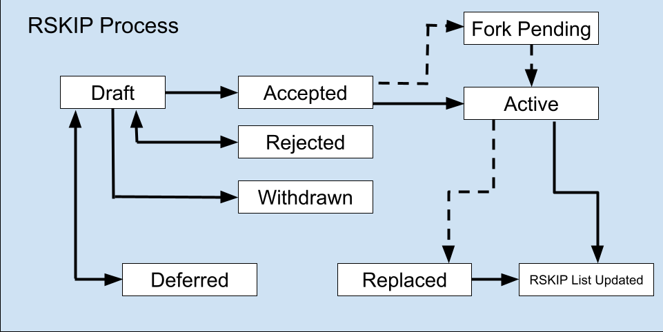

    RSKIP: 0
      	Title: RSKIP Purpose and Guidelines
      	Status: Active
      	Type: Process
      	Author: Julián Len <julian@rsk.co>, Sergio Lerner <sergio@rsk.co>
      	Created: 2018-03-06

## What is a RSKIP?

RSKIP stands for RSK Improvement Proposal. A RSKIP is a design document providing information to the RSK community, or describing a new feature for RSK or its processes or environment.The RSKIP should provide 
a consise technical specification of the feature and a rationale for the feature. 

--------------
## RSKIP Rational

We intend RSKIPs to be the primary mechanisms for proposing new features, for collecting community input on an issue, and for documenting the design decisions that have gone into RSK. Because the RSKIPs are maintained as text files in a versioned repository, their revision history is the historical record of the feature proposal.

For RSK implementers, RSKs are a convenient way to track the progress of their implementation. Ideally each implementation maintainer would list the RSKIPs that they have implemented. This will give end users a convenient way to know the current status of a given implementation or library.

--------------
## RSKIP Types

There are three types of RSKIP:

-	A **Standard Track RSKIP** describes any change that affects most or all RSK implementation, such as a change to the network protocol, a change in block or transaction validity rules, or any chance or addition that affects the interoperability of applications using RSK. Furthermore Standard RSKIPS can be broken down into the following categories.
	* **CORE** - CORE, consensus related
	* **Node** - Related to node manager interfaces, such as RPC
	* **Net** - related to p2p networking
	* **UI** - User Interface
	* **2nd** - 2nd layer protocols, such as off-chain payment channels
	* **DApp** - Dapp application interfaces
- An **Informational RSKIP** describes a RSK design issue, or provides general guidelines or information to the RSK community, but does not propose a new feature. Informational RSKIPs do not necessarily represent a RSK community consensus or recommendation, so users and implementors are free to ignore Informational RSKIPs or follow their advice.
- A **Process RSKIP** describes a process surrounding RSK, or proposes a change to (or an event in) a process. Process RSKIPS are like Standards Track RSKIPs but apply to areas other than the RSK protocol itself. They may propose an implementation, but not to RSK's codebase; they often require community consensus; unlike Informational RSKIPs, they are more than recommendations, and users are typically not free to ignore them. Examples include procedures, guidelines, changes to the decision-making process, and changes to the tools or environment used in RSK development. Any meta-RSK is also considered a Process RSK.

--------------
## RSKIP purpose terms

Describes what aspects of RSK improves

* **Sca** - an RSKIP that improves scalability
* **Usa** - an RSKIP that improves usability
* **Fair** - an RSKIP that has improves fairness
* **Sec** - an RSKIP that that improves security

--------------
## RSKIP purpose complexity

It is also necessary to describe the complexity of the improvement with the following levels

* **1** - Minimal
* **2** - Medium
* **3** - High

--------------
## RSKIP Work Flow

The RSKIP repository Collaborators change the RSKIPs status. Please send all RSKIP-related email to the RSKIP Editors, which is listed under RSKIP Editors below. Also see RSKIP Editor Responsibilities & Workflow.

The RSKIP process begins with a new idea for RSK. It is highly recommended that a single RSKIP contain a single key proposal or new idea. The more focused the RSKIP, the more successful it tends to be. A change to one client doesn't require an RSKIP; a change that affects multiple clients, or defines a standard for multiple apps to use, does. The RSKIP editor reserves the right to reject RSKIP proposals if they appear too unfocused or too broad. If in doubt, split your RSKIP into several well-focused ones.

Each RSKIP must have a champion -- someone who writes the RSKIP using the style and format described below, shepherds the discussions in the appropriate forums, and attempts to build community consensus around the idea. The RSKIP champion (a.k.a. Author) should first attempt to ascertain whether the idea is RSKIP-able. 

Vetting an idea publicly before going as far as writing an RSKIP is meant to save the potential author time. Asking the RSK community first if an idea is original helps prevent too much time being spent on something that is guaranteed to be rejected based on prior discussions. It also helps to make sure the idea is applicable to the entire community and not just the author. Just because an idea sounds good to the author does not mean it will work for most people in most areas where RSK is used. Examples of appropriate public forums to gauge interest around your RSKIP include [the RSK subreddit], [the Issues section of this repository], and [one of the RSK Gitter chat rooms].

Once the champion has asked the RSK community whether an idea has any chance of acceptance a draft RSKIP should be presented as a [pull request]. This gives the author a chance to continuously edit the draft RSKIP for proper formatting and quality. This also allows for further public comment and the author of the RSKIP to address concerns about the proposal.

If the RSKIP editor approves, the issuer of the RSKIP must assign the PR number to the RSKIP, renaming it. Then label it as Standards Track, Informational, or Process, give it status "Draft", in addition the editor will put what level the RSKIP has and what kind of improvement is, and then add it to the git repository. The RSKIP editor will not unreasonably deny a RSKIP. Reasons for denying RSKIP status include duplication of effort, being technically unsound, not providing proper motivation or addressing backwards compatibility, or not in keeping with the RSK philosophy.

The RSKIP author may update the Draft as necessary in the git repository. Updates to drafts may also be submitted by the author as pull requests.

Standards Track RSKIPs consist of three parts, a design document, implementation, and finally if warranted an update to the formal specification. The RSKIP should be reviewed and accepted before an implementation is begun, unless a reference implementation will aid people in studying the RSKIP. 

Standards Track RSKIPs must include an implementation -- in the form of code, a patch, or a URL to same -- before it can be considered Actived or Pending Fork.

RSKIP authors are responsible for collecting community feedback on a RSKIP before submitting it for review. However, wherever possible, long open-ended discussions on public mailing lists should be avoided. Strategies to keep the discussions efficient include: setting up a separate SIG mailing list for the topic, having the RSKIP author accept private comments in the early design phases, setting up a wiki page or git repository, etc. RSKIP authors should use their discretion here.

For a RSKIP to be "Accepted" it must meet certain minimum criteria. It must be a clear and complete description of the proposed enhancement. The enhancement must represent a net improvement. The proposed implementation, if applicable, must be solid and must not complicate the protocol unduly.
Once a RSKIP has been Accepted, the implementations must be completed. When the implementation is complete and accepted by the community, the status will be changed to “Pending Fork” if it is neccesary a hard or soft fork, and Actived if not.

A RSKIP can also be assigned status “Deferred”. The RSKIP author or editor can assign the RSKIP this status when no progress is being made on the RSKIP. Once an RSKIP is deferred, the RSKIP editor can re-assign it to draft status. An RSKIP that is not being considered for immediate adoption in the reference client. May be reconsidered in the future for a subsequent release of the reference client.

An RSKIP can also be “Rejected”. Perhaps after all is said and done it was not a good idea. It is still important to have a record of this fact.

RSKIPs can also be superseded by a different RSKIP, rendering the original obsolete. 

The possible paths of the status of RSKIPs are as follows:

  

--------------
## What belongs in a successful RSKIP?

Each RSKIP should have the following parts:

-	Preamble -- RFC 822 style headers containing meta-data about the RSKIP, including the RSKIP number, a short descriptive title (limited to a maximum of 44 characters), the names, and optionally the contact info for each author, etc.
<!-- -->

-	Abstract -- a short (~200 word) description of the technical issue being addressed.
<!-- -->

-	 Motivation -- The motivation is critical for RSKIPs that want to change the RSK protocol. It should clearly explain why the existing protocol specification is inadequate to address the problem that the RSKIP solves. RSKIP submissions without sufficient motivation may be rejected outright.
<!-- -->

-	Specification -- The technical specification should describe the syntax and semantics of any new feature. The specification should be detailed enough to allow competing, interoperable implementations for any of the current RSK platforms.
<!-- -->

-	Rationale -- The rationale fleshes out the specification by describing what motivated the design and why particular design decisions were made. It should describe alternate designs that were considered and related work, e.g. how the feature is supported in other languages. The rationale should provide evidence of consensus within the community and discuss important objections or concerns raised during discussion.
<!-- -->

-	Backwards Compatibility -- All RSKIPs that introduce backwards incompatibilities must include a section describing these incompatibilities and their severity. The RSKIP must explain how the author proposes to deal with these incompatibilities. RSKIP submissions without a sufficient backwards compatibility treatise may be rejected outright.
<!-- -->

-	Implementations - The implementations must be completed before any RSKIP is given status “Final”, but it need not be completed before the RSKIP is accepted. While there is merit to the approach of reaching consensus on the specification and rationale before writing code, the principle of “rough consensus and running code” is still useful when it comes to resolving many discussions of API details.
<!-- -->

-	Test Cases - Test cases for an implementation are mandatory for RSKIPs that are affecting consensus changes. Other RSKIPs can choose to include links to test cases if applicable.
<!-- -->

-	Copyright Waiver - All RSKIPs must be in public domain. See the bottom of this RSKIP for an example copyright waiver.
<!-- -->

-	The final implementation must include test code and documentation appropriate for the RSK protocol.

--------------
## RSKIP Formats and Templates

RSKIPs should be written in markdown format. Image files should be included in a subdirectory for that RSKIP.

--------------
## RSKIP Header Preamble

Each RSKIP must begin with an RFC 822 style header preamble. The headers must appear in the following order. Headers marked with "*" are optional and are described below. All other headers are required.

` RSKIP: ` <RSKIP number> (this is determined by the RSKIP editor)
	
` Title: `<RSKIP title>

` Author: `<list of author's real names and optionally, email address>

` * Discussions-To: ` <email address>

` Status: `<Draft | Active | Accepted | Deferred | Rejected | Withdrawn | Adopted | Superseded>

` Type: `<Standards Track | Informational | Process>

` Created: `<date created on, in ISO 8601 (yyyy-mm-dd) format>

` * Replaces: `<RSKIP number>

` * Superseded-By: `<RSKIP number>

` * Resolution: `<url>

The Author header lists the names, and optionally the email addresses of all the authors/owners of the RSKIP. The format of the Author header value must be

 Random J. User <address@dom.ain>
if the email address is included, and just

 Random J. User
if the address is not given.

If there are multiple authors, each should be on a separate line following RFC 2822 continuation line conventions.

Note: The Resolution header is required for Standards Track RSKIPs only. It contains a URL that should point to an email message or other web resource where the pronouncement about the RSKIP is made.

While a RSKIP is in private discussions (usually during the initial Draft phase), a Discussions-To header will indicate the mailing list or URL where the RSKIP is being discussed. No Discussions-To header is necessary if the RSKIP is being discussed privately with the author, or on the rsk email mailing lists.

The Type header specifies the type of RSKIP: Standards Track, Informational, or Process. If the track is Standards please include the subcategory (core, networking, interface, etc).

The Created header records the date that the RSKIP was assigned a number, while Post-History is used to record the dates of when new versions of the RSKIP are posted to rsk mailing lists. Both headers should be in yyyy-mm-dd format, e.g. 1994-08-12.

RSKIPs may have a Requires header, indicating the RSKIP numbers that this RSKIP depends on.

RSKIPs may also have a Superseded-By header indicating that a RSKIP has been rendered obsolete by a later document; the value is the number of the RSKIP that replaces the current document. The newer RSKIP must have a Replaces header containing the number of the RSKIP that it rendered obsolete.

--------------
## Auxiliar Files

RSKIPs may include auxiliary files such as diagrams. Such files must be named RSKIP-XXXX-Y.ext, where "XXXX" is the RSKIP number, "Y" is a serial number (starting at 1), and "ext" is replaced by the actual file extension (e.g. "png").

--------------
## Transferring RSKIP Ownership

It occasionally becomes necessary to transfer ownership of RSKIPs to a new champion. In general, we'd like to retain the original author as a co-author of the transferred RSKIP, but that's really up to the original author. A good reason to transfer ownership is because the original author no longer has the time or interest in updating it or following through with the RSKIP process, or has fallen off the face of the 'net (i.e. is unreachable or not responding to email). A bad reason to transfer ownership is because you don't agree with the direction of the RSKIP. We try to build consensus around a RSKIP, but if that's not possible, you can always submit a competing RSKIP.

If you are interested in assuming ownership of a RSKIP, send a message asking to take over, addressed to both the original author and the RSKIP editor. If the original author doesn't respond to email in a timely manner, the RSKIP editor will make a unilateral decision (it's not like such decisions can't be reversed :).

--------------
## RSKIP Editors

` * Sergio Lerner (@sergioLerner) `

--------------
## RSKIP Editor Responsibilities and Workflow

For each new RSKIP that comes in, an editor does the following:

- Read the RSKIP to check if it is ready: sound and complete. The ideas must make technical sense, even if they don't seem likely to be accepted.
- The title should accurately describe the content.
- Edit the RSKIP for language (spelling, grammar, sentence structure, etc.), markup, code style.
If the RSKIP isn't ready, the editor will send it back to the author for revision, with specific instructions.

Once the RSKIP is ready for the repository, the RSKIP editor will:

- Add the RSKIP to the rsk/rskips repository on GitHub.
- List the RSKIP in README.md
- Send a message back to the RSKIP author with next step.

Many RSKIPs are written and maintained by developers with write access to the RSK codebase. The RSKIP editors monitor RSKIP changes, and correct any structure, grammar, spelling, or markup mistakes we see.

The editors don't pass judgment on RSKIPs. We merely do the administrative & editorial part.

--------------
## History

This document was derived heavily from Ethereum's EIP-1 written by Martin Becze and from Bitcoin's BIP-0001 written by Amir Taaki which in turn was derived from Python's PEP-0001. In many places text was simply copied and modified. Although the PEP-0001 text was written by Barry Warsaw, Jeremy Hylton, and David Goodger, they are not responsible for its use in the RSK Improvement Process, and should not be bothered with technical questions specific to RSK or the RSKIP. Please direct all comments to the RSKIP editors.

  [the RSK subreddit]: https://www.reddit.com/r/rootstock/
  [one of the RSK Gitter chat rooms]: https://gitter.im/rsksmart/
  [formal specification]: https://github.com/ethereum/yellowpaper
  [the Issues section of this repository]: https://github.com/rsksmart/RSKIPs/issues
  [markdown]: https://github.com/adam-p/markdown-here/wiki/Markdown-Cheatsheet
  [README.md]: README.md "wikilink"
  [Bitcoin's BIP-0001]: https://github.com/bitcoin/bips
  [Python's PEP-0001]: https://www.python.org/dev/peps/
  [pull request]: https://github.com/rsksmart/RSKIPs/pulls

---------
## Copyright

Copyright and related rights waived via [CC0](https://creativecommons.org/publicdomain/zero/1.0/).
