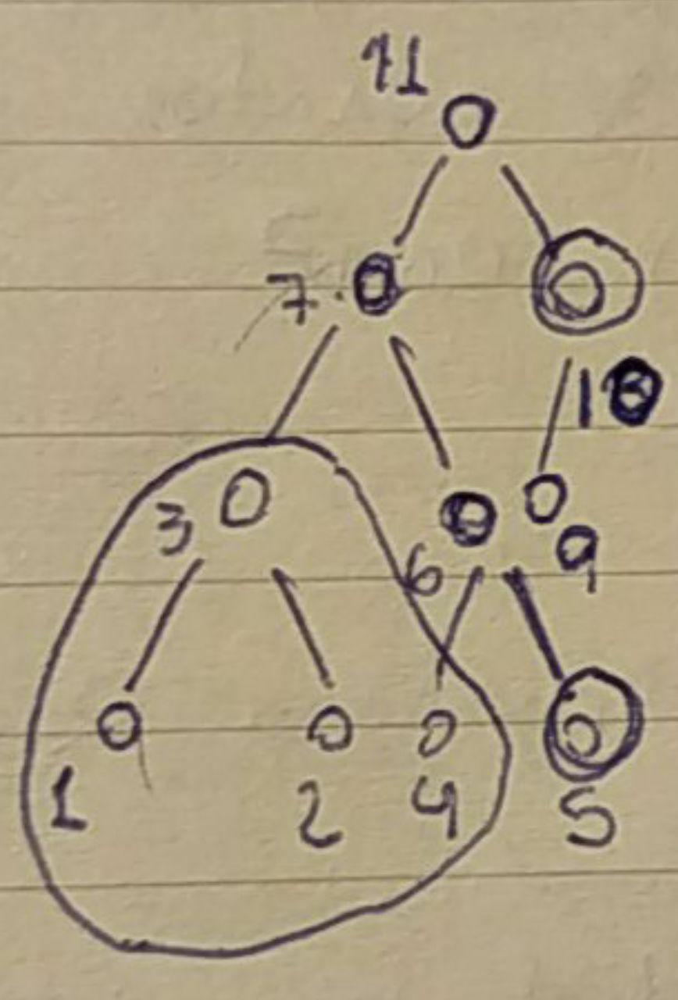
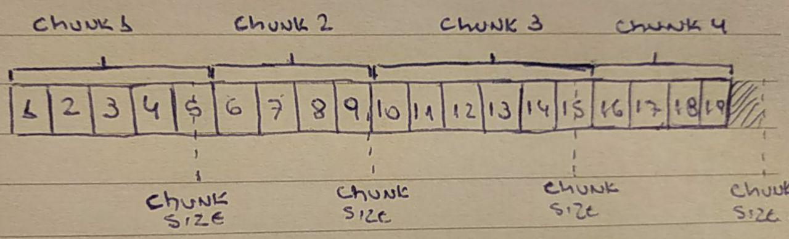

# State sync

|RSKIP          |136           |
| :------------ |:-------------|
|**Title**      |State sync|
|**Created**    |2019 |
|**Author**     |LS & IM |
|**Purpose**    |Usa |
|**Layer**      |Core |
|**Complexity** |2 |
|**Status**     |Draft |

# **Abstract**

This document describes a new mechanism to synchronize RSK nodes. This mechanism would allow a faster synchronization to the RSK blockchain by downloading only the state and other necessary components.

# Motivation

The current synchronization mechanism requires the transfer of every block in the blockchain and their sequential execution to both validate and generate the updated state. A different approach is required if we want to scale the synchronization process with a long blockchain.

A node is considered synchronized at block number B if it has all the neccesary information to start downloading and executing blocks from B onwards in a secure way. There are some pieces of information required:

A) The addresses state at block number B implemented by the merkle tree. This is currently obtained by executing the transactions since the genesis block. 

B) Having a verified block B which matches the merkle tree. This requires the validation of the proof of work on block B, which recursively requires every block header since the genesis block.

C) Having B_pos blocks headers from B onwards which validate the proof of work for both B and the state downloaded at B.

D) In order to execute blocks from B onwards the REMASC information (currently being uncles and header) from at least the last B_pre blocks is required.

    

The goal for this new algorithm, which we'll call STATE-SYNC, is to reach a synchronized blockchain at a B but without paying the cost of downloading and executing all the missing blocks.

# Specification

In order to achieve this the process will be divided in a series of sequential steps.

### 1) Define the block B
The idea is that nodes only synchronize at possible "checkpoints". 

If the number of the tip is TIP = 10090,  checkpoints are defined every CHK = 1000 blocks, and B_pos = 100. 

B would be set as (B_tip-B_pos // CHK)*CHK = 9000.

Having the B_pos constraint forces to have at least the information for the last two checkpoints to be able to answer this request.

### 2) Retrieve the headers and validate the PoW
To validate that the state we'll try to rebuild is valid, every header from genesis to tip is required.

### 3) Retrieve every block from B-B_pre to B+B_pos
By now we only have the verified headers, the block bodies is needed to resume execution.

### 4) Retrieve the state at point B
The state can be synchronized at the same time as 3).
The root hash must be requested first, this information will be the metadata we need to build the entire tree.

Every node in the tree has the size information of their childrens. This allows a postorder traversal of the tree by increasing an offset value.

The idea is to divide the whole tree in CHUNKS of size of at least CHUNK_SIZE and transfer this unit of data in each request. Every CHUNK contains a variable amount of tree nodes and every node in the chunk must be fully serialized, it cannot be split. To verify CHUNKS by themselves, extra information in the form of hashes also have to be added to the packet. 

    

If only nodes 1 to 4 fit in the CHUNK, hashes for nodes 5 and 10 are required to verify the tree up to the root hash.

If a CHUNK splits a node, only part of it is sent as a response and it is not validated as part of that CHUNK. It will be validated with it's corresponding complementary hashes with the next CHUNK.

    

### 5) Continue regular blockchain execution
At this stage, every requirement to have a synchronized node is fulfilled. The blockchain header is B.

### 6) Download old blocks (optional)
Download old blocks body along with their receipts.

# Rationale

Before downloading the state it's important to verify that we actually have the correct block. That's why old headers are required.
Posterior headers further verify the B block and requires possible attackers to generate at least B_pos valid headers.

The state transfer protocol was designed to allow having a sequential snapshot file on disk and avoid redundant reads.

# **Copyright**

Copyright and related rights waived via [CC0](https://creativecommons.org/publicdomain/zero/1.0/).