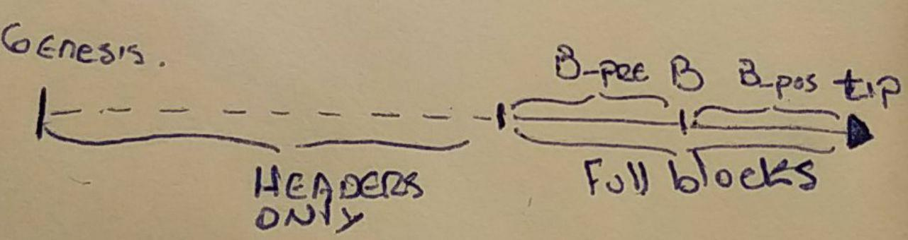

# State sync

|RSKIP          |137           |
| :------------ |:-------------|
|**Title**      |State sync|
|**Created**    |2019 |
|**Author**     |LS & IM |
|**Purpose**    |Usa |
|**Layer**      |Core |
|**Complexity** |2 |
|**Status**     |Draft |

# **Abstract**

This document describes a new mechanism to synchronize RSK nodes. This mechanism would allow a faster synchronization to the RSK blockchain by downloading only the state and other necessary components.

# Motivation

The current synchronization mechanism requires the transfer of every block in the blockchain and their sequential execution to both validate and generate the updated state. A different approach is required if we want to scale the synchronization process with a long blockchain.

A node is considered synchronized at block number B if it has all the neccesary information to start downloading and executing blocks from B onwards in a secure way. There are some pieces of information required:

A) The addresses state at block number B implemented by the merkle tree. This is currently obtained by executing the transactions since the genesis block. 

B) Having a verified block B which matches the merkle tree. This requires the validation of the proof of work on block B, which recursively requires every block header since the genesis block.

C) Having B_pos blocks headers from B onwards which validate the proof of work for both B and the state downloaded at B.

D) In order to execute blocks from B onwards the REMASC information (currently being uncles and header) from at least the last B_pre blocks is required.

    

The goal for this new algorithm, which we'll call STATE-SYNC, is to reach a synchronized blockchain at a B but without paying the cost of downloading and executing all the missing blocks.

# Specification

In order to achieve this, the process will be divided in a series of sequential steps.

### 1) Define the block B
The idea is that nodes only synchronize at defined "checkpoints". 

If the number of the best block is BB = 10090,  checkpoints are defined every CHK = 1000 blocks, and B_pos = 100. 

B would be set as ((BB - B_pos) // CHK)* CHK = 9000.

Having the B_pos constraint forces to have at least the information for the last two checkpoints to be able to answer this request.

### 2) Retrieve the headers and validate the PoW
To validate the new state every header from genesis until B + B_pos is required.

### 3) Retrieve every block from B - B_pre to B
By now we only have the verified headers, the block bodies are needed to resume execution.

### 4) Retrieve the state at point B
The state can be downloaded at the same time as 3).
The root hash from block B must be requested first. This information will be the starting point to download the complete tree.

### 5) Continue regular blockchain execution
At this stage, every requirement to have a synchronized node is fulfilled. The node's best block is B.

### 6) Download old blocks (optional)
Download old blocks bodies along with their receipts.

### **State at point B**
When the program reaches this point, it will require new messages to download a piece of the state. For this purpose a new pair of messages are implemented: GetStateNode and ResponseStateNode. The first one takes the hash to request the state node to another client. The second one encodes all the information required to recreate it. With this information the program is able to request the next hashes in order to continue downloading and have all the information to recreate the whole state. A nice feature from the current state structure is the ability to validate the data on each request independently from the rest of the state. 

# Rationale

Before downloading the state it's important to verify that the block B is valid. To ensure this, all the previous headers are required.
The next headers descending from block B provide a way to require an computational effort from a possible attacker who intends to send malicious information.

# **Copyright**

Copyright and related rights waived via [CC0](https://creativecommons.org/publicdomain/zero/1.0/).