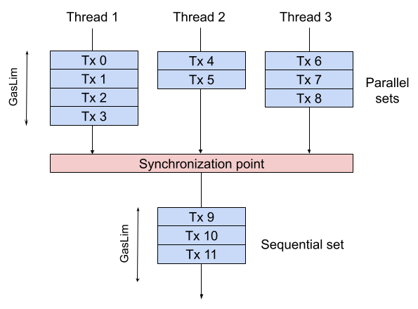

# Precompiled contracts for +/* on Secp256k1

|RSKIP          |    144           |
| :------------ |:-------------|
|**Title**      |Parallel Transaction Execution for Unitrie|
|**Created**    |23-OCT-2019 |
|**Author**     |SDL |
|**Purpose**    |Sca |
|**Layer**      |Core |
|**Complexity** |3 |
|**Status**     |Draft |

# Abstract

This RSKIP describes how miners partition transactions into disjoint sets in order to be safely parallelized, and how full nodes should process transactions.

# Motivation

Parallelizing the execution of transactions allows increasing the block gas limit without increasing the block execution time, and improves the scalability of RSK by increasing the transaction throughput.

Now, RSK nodes process transactions from blocks one by one, in the specified order. This is because the final state after processing two transactions when applied in different order may differ. However most transactions do not use the same keys of the state and therefore they could be parallelized without interference.

There are several obstacles to parallelization. [RSKIP02](RSKIP02) and [RSKIP04](RSKIP04) explore different methods that worked prior the implementation of the Unitrie. This RSKIP proposes using a runtime method to partition the transaction set into threads similar to RSKIP04 but tailored for the Unitrie.

Miners must specify a valid execution plan that is included in the block header. We propose a greedy algorithm that produces a satisfactory plan. In our algorithm, miners are forced to serialize transaction execution to create blocks. At the same time they execute the transactions, they discover runtime key-access overlaps between transactions and build an execution plan. Miners can also use alternative methods to produce optimized schedules. For a simpler overlap detection and to prevent DoS attacks, an additional part is added including all the transactions that could not be parallelized, that is executed after the execution of the parallel parts is completed. Once all transactions have been processed, the partition is created along with a schedule that determines which transactions belong in each part.

Full nodes can use this schedule to split the transaction set and parallelize execution.

# Specification

Transactions in a block are divided into `N+1` sublists, where the first `N` sublists are executed in parallel and the last sublist is executed after the others. We refer to the first `N` sublists as the _parallel sublists_ and to the last partition as the _sequential sublist_.

   
  <em>Block with 3+1 sublists. The 3 sublists are run in parallel, and after completion of all, the 4th sublist is run.</em>

## New block gas limits

Each sublist has its own gas limit value. The block `gasLimit` constant is replaced for two new constants:
- `parallelSublistGasLimit` is the gas limit for each _parallel sublists_
- `sequentialSublistGasLimit` is the gas limit for the _sequential sublist_

Both _parallel sublists_ and _sequential sublist_ values are equal to `(block gas limit/ N+1)`.

The gas limit in each sublist must be treated similar to how the block gas limit was treated. The sum of the gas used of all the transactions in a sublist cannot exceed the sublist's gas limit.

> As a result, the total gas than can be used per block is equal to the block gas limit.

> In consequence, the maximum gas used by a transaction is the sublist gas limit.

## New block extension header field

A new field `txExecutionSublistsEdges` is added to the block header extension. It determines how transactions are partitioned in a block. This field consists of an array of short unsigned integers that indicates at which position in the transaction list each sublist ends.

For example, in a block with 10 transactions, `txExecutionSublistsEdges = [3, 6]` indicates that the first _parallel sublist_ contains transactions 0, 1 and 2; the second _parallel sublist_ contains transactions 3, 4 and 5; and the _sequential sublist_ contains transactions 6 to 9.

A new constant `maxTransactionExecutionThreads` is specified. It determines the minimum number of cores required to run the RSK node. Initially, `maxTransactionExecutionThreads = 4`

- Values in `txExecutionSublistsEdges` must be greater than 0 and in ascending order.
- An empty `txExecutionSublistsEdges` indicates that all transactions go in the _sequential sublist_.
- The maximum number of parallel sublists that the miner can specify is equal to `maxTransactionExecutionThreads`.
- The REMASC transaction must be included as the last transaction of the sequential sublist.

> See RSKIP 351 for block header extension definition

## New block validation consensus

It must be ensured that blocks that have transactions that are executed in parallel always produce the same output. Therefore, when a block is executed (either in parallel or sequentially) nodes must verify the resulting world state is deterministic as if it had been executed sequentially.

For simplicity, two transactions are defined as _connected_ if:
- Both transactions write the same storage key
- One transaction reads a key that the other transaction writes

Any pair of transactions that are _connected_ cannot be in different parallel sublists. If so, the block must be rejected.

> Transactions that are from the same sender account are considered _connected_ because they modify the nonce.

> Recursive deletes must be correctly and efficiently handled. If a transaction deletes a contract using `SELFDESTRUCT` and another transaction is reading or writing a key of that contract, those two transactions must be considered _connected_.

> Sending 0 balance to a non-existent account creates that account. Hence, a key is considered written.

### Block validation algorithm

A `readMap` and a `writeMap` is created per _parallel sublist_. During execution of each sublist,
- when a storage key is read, it is marked in the `readMap`,
- when a key is written, the key is marked in the `writeMap`.

When all parallel sublists have finished processing, the `readMap`s and `writeMap`s are scanned to find connections between transactions of different threads. This requires efficient maps that enable traversing the keys in ascending lexicographic order.
- If a key belongs to a `writeMap` and a `readMap` of another _parallel sublist_, then the block is considered invalid.
- If a key belongs to a `writeMap` and a `writeMap` of another _parallel sublist_, then the block is also considered invalid.

The _sequential sublist_ does not need any new validation.

# Suggested miner implementation

When a miner executes transactions to create an (unsolved) block, the miner must execute the transactions serially and decide which sublist the transaction belongs to. The block gas limit is replaced by a per-sublist gas limit.

Following the connection types between transactions described above, a transaction is connected to a _parallel sublist_ if it is connected to any transaction in that sublist. The miner maintains a `writeMap` and a `readMap` that store which sublist/s write or read each storage key. The miner then executes transactions from the pool and keeps track of which storage keys the transaction reads and writes. After executing the transaction, the miner compares the transaction read and written keys with the `readMap` and `writeMap`. The following scenarios are possible:

1. The transaction is not connected to any existing sublist:
    1. The miner assigns the transaction to an empty _parallel sublist_
    2. If no empty sublist exists, the miner assigns the transaction to the less full _parallel sublist_
    3. If all _parallel sublists_ are full, the miner assigns the transaction to the _sequential sublist_
2. The transaction is connected to one _parallel sublist_:
    1. The miner assigns the transaction to the _parallel sublist_
    2. If the _parallel sublist_ is full, the miner assigns the transaction to the _sequential sublist_
3. The transaction is connected to more than one _parallel sublists_:
    1. The miner assigns the transaction to the _sequential sublist_
    2. Alternatively, the miner might merge the connected sublists and assign the transaction there

After assigning a transaction to a sublist, the miner updates the `readMap` and `writeMap` accordingly. When no more transactions can be included in the block, the miner executes the block in parallel to produce the final state.

To prevent DoS attacks, miners only execute a transaction if it fits in the sequential set. In this way, miners are guaranteed to include the transaction in the block regardless of the read and written storage keys.

# Copyright

Copyright and related rights waived via [CC0](https://creativecommons.org/publicdomain/zero/1.0/).
