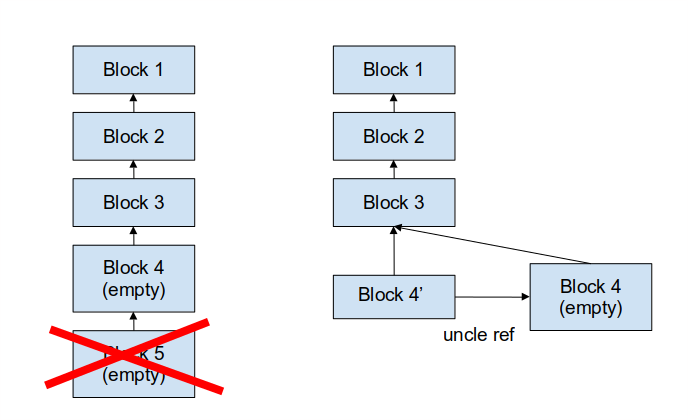
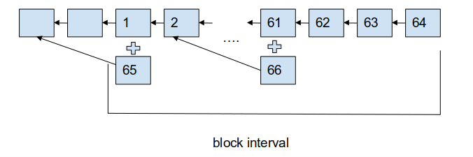

# Simplified Reward Manager Smart Contract (REMASC)

|RSKIP          |15           |
| :------------ |:-------------|
|**Title**      |Simplified Reward Manager Smart Contract (REMASC)|
|**Created**    |15-NOV-2016 |
|**Author**     |SDL |
|**Purpose**    |Sca |
|**Layer**      |Core |
|**Complexity** |3 |
|**Status**     |Adopted |

# **Abstract**

RSK will be the first blockchain based on proof-of-work consensus that has no subsidy. Also RSK will be the fastest existent PoW blockchain. All network parameters and protocols in RSK blockchain must create an incentive structure that incentivizes the honest behaviour of all participants. The main design decision that provides such guarantee is how the transaction fees are split between miners. At the same time, RSK wants to maintain the other usual design goals, such as preventing excessive centralization. Such stringent requirements ask for novel solutions, and it has become clear that due to the numerous possible attack vectors, such solution will not be a simple one.  However, the solution must fit into the smart contract framework easily, without interfering or preventing the achievement of other platform goals, such as allowing nodes to easily download the blockchain state from the worldstate trie, without additional state data. Therefore this RSKIP proposes that the reward splitting algorithm is coded into a smart contract, which will be called REMASC (Reward Manager Smart Contract). By doing this, all extra state will be part of the REMASC persistent storage. The REMASC contract can be a native one.

# **Motivation**

The following is a list of the design goals behind RSK reward splitting strategy and consensus protocol:

1. The blockchain consensus is driven by SHA256D merge-mined proof-of-work

2. The desired average block interval is 10 seconds.

3. The consensus protocol should not include new incentives for mining centralization.

4. The consensus protocols should reduce incentives from block withholding [[https://petertodd.org/2016/block-publication-incentives-for-miners](https://petertodd.org/2016/block-publication-incentives-for-miners)]

5. The consensus protocol should reduce centralization incentives derived from stale blocks. [[https://blog.ethereum.org/2014/07/11/toward-a-12-second-block-time/](https://blog.ethereum.org/2014/07/11/toward-a-12-second-block-time/)] and [Accelerating Bitcoin's Transaction Processing, Fast Money Grows on Trees, Not Chains, Sompolinsky, Zohar] 

6. The consensus protocol should reduce the probability of transaction reversal as much as possible.

7. Therefore, the consensus protocol should not allow profit from selfish-mining [Majority is not Enough: Bitcoin Mining is Vulnerable, Eyal, Gun Sirer, avilable at [https://arxiv.org/pdf/1311.0243v5.pdf](https://arxiv.org/pdf/1311.0243v5.pdf)]

8. The consensus protocol must be incentive compatible [ Incentive Compatibility of Bitcoin Mining Pool Reward Functions, Schrijvers, Bonneau, Boneh, Roughgarden, available at [http://theory.stanford.edu/~tim/papers/bitcoin.pdf](http://theory.stanford.edu/~tim/papers/bitcoin.pdf) ]

9. The consensus protocol should not allow profit from Camacho selfish-mining [DECOR+LAMI: A Scalable Blockchain Protocol, [https://scalingbitcoin.org/papers/DECOR-LAMI.pdf](https://scalingbitcoin.org/papers/DECOR-LAMI.pdf) ]

10. The consensus protocol should not allow profit from Uncle mining. [[https://bitslog.wordpress.com/2016/04/28/uncle-mining-an-ethereum-consensus-protocol-flaw/](https://bitslog.wordpress.com/2016/04/28/uncle-mining-an-ethereum-consensus-protocol-flaw/) ]

11. The consensus protocol should prevent instabilities from no-subsidy mining [On the Instability of Bitcoin Without the Block Reward, Carlsten,Kalodner,Weinberg, Narayanan, available at [http://randomwalker.info/publications/mining_CCS.pdf](http://randomwalker.info/publications/mining_CCS.pdf) ]

12. It should allow for mining blocks without executing validating parent block transaction (for validation-less mining up to certain depth)

13. The mining rewards should not be paid to miners until a certain maturity period (in terms of blocks) has elapsed. This time-delayed rewards adds more pressure for miners not to attack the network, and rewards held by the platform act as a security bond.

14. The penalization for not including a competing uncle should be higher than the loss for sharing the reward. This considering the cost of bribing subsequent miners not to include the uncle.

15. The REMASC should pay 20% of the miner earnings to RSK

16. RSK should use a contract with key multi-key security, key-rotation, rate-limit, and vault functionality (rollback keys).

17. The consensus should be prevented from chain-quality attacks [The Bitcoin Backbone Protocol: Analysis and Applications, Garay, Kiayias, [https://eprint.iacr.org/2014/765.pdf](https://eprint.iacr.org/2014/765.pdf) ]

18. The REMASC contract should avoid selfish withholding a sibling block. The scenario is: A rogue miner mines a block A. Before publishing it, the miner realizes there is a sibling block B for A. According to  DECOR+ selection rule, A should be the mainchain block. The miner withholds A and lets the network mine a block C on top of B. Later on the miner mines a block X and includes A as uncle. The rogue miner gets an unfair benefit: i) It has a 100% chance of receiving the publisher fee for publishing A. ii) Makes sure the miner of C is penalized for not following DECOR+ selection rule.

## Solution

This RSKIP proposes a protocol and an implementation that tries to satisfy the design goals.

The fees collected by any block are not paid directly to the miner of the block, but they are transferred to a native smart contract called REMASC. The transfer is done automatically, and corresponds to an emulated simple transaction that carries all of the block’s transaction fees as value.

The strategy proposed here is a variation of DECOR+. In a nutshell, the strategy is to share the block reward between all miners that have solved a block of the same height, and also with subsequent miners. To help the explanation we'll first assume for a moment that all block fees are almost equal so each miner receives almost the same net payment for a block (there is no difficulty adjustment, nor subsidy, only a never ending transaction backlog). We'll also simplify the explanation by limiting ourselves to a conflict between two miners, and we'll later show this is the most common case. Whenever two miners (Alice and Bob) mine two competing blocks (a block conflict) the following happens:

- If one block has a reward higher than two times the other block reward, both miners decide to mine on top of the one with highest reward

- Else, miners decide to mine on top of the block with the lowest hash.

- No matter the reward value of the block, if one block has more uncles than the other, both miners should mine on top of the one with the highest number of uncles.

This will be the conflict block selection rule. For miners to be able to compare competing blocks, all conflicting blocks headers that are not too old (no more than 10 steps back of the chain tip) are forwarded by the network. If a miner Carol (which could be also Alice or Bob) solves a following block, she can decide to include in her block a reference to the uncle block header that was left out of the main chain, can collect an extra prize when the coinbase of the conflicting block matures. 

# **Specification**

Several modifications are required:

* DECOR+ sticky parent selection rule

* Chain Comparison Rule

* REMASC smart-contract

* block header changes

* Difficulty adjustment

* Fast header-only or compact block propagation

## Changes to the Block header

Block headers have a new **empty** boolean field. If empty is true, then the follow conditions must be valid for the block to be valid:

- block must not have any transactions.

- stateRoot value in must be zero (especial value)

- Must not reference any uncle.

- the paidFees must be zero

This implies that a miner can perform validation-less mining by setting the empty flag to true, and the stateRoot to zero, if they know the gparentStateRoot value. gparentStateRoot value corresponds to the stateRoot hash of the grand-parent block. Because no stateRoot value is visible in blocks, can only be known if it computed. A miner cannot discover the gparentStateRoot value when receiving a competing block, since it will be masked by the commitment. 

A miner can’t mine a empty block that is child of an empty parent. Empty blocks can be uncles or be on the mainchain.


 
## **The REMASC contract is never executed on empty blocks.**

## Chain Comparison Rule

To prevent the Camacho attack, we’ll add the sticky rule to the DECOR+GHOST chain selection rule.

* If both competing chains have the different GHOST weight, to heaviest becomes the best chain

* If both competing chains have the same GHOST weight, the one obeying the DECOR+ selection rule following the last branch block is chosen.

The following example illustrates how the node chooses A2 instead of B2, even if B2 was received first and both have the same GHOST weight, because A1 obeyed the DECOR+ selection rule while B1 did not.


## REMASC contract

The prices and rewards are computed according to the following steps:

* For every block there is a pre-existent Reward balance (RB).

* Also there is always a Burned Balance (BB).

* All the fees paid in a block are accumulated into the RB.

* 10% of the RB is extracted as the Full Block Reward (FBR).

* 20% of the FBR is paid to RSK.

* A 10% of the remaining FBR is the **publisher's fee**, and it is shared in equal parts between the miners that include sibling headers. If there are not sibling headers other than the main one, there is no publishers fee. 

* If the conflicting block and sibling headers do not obey the selection rule a **punishment fee** of 10% is subtracted from the FBR. The punishment fee is burned by transferring it to the BB. If there are no siblings other than the main one, there is no punishment fee.

* The remaining FBR is the **reward share** and it is split in equal parts between the miners that solved the all the sibling blocks (including the miner of the block in the mainchain and the miners that solved the sibling headers).   

* The mainchain miner is paid the reward share

* Sibling blocks receive an extra punishment in case of late inclusion as uncle. If the sibling block is not included as uncle by the son of its sibling, a punishment of 5% per late block is applied. The punishment is burned by transferring it to the BB.

* Wherever fees are shared and division has a remainder, the remainder is burned by transferring it to the BB.

* If a hacker/fool sends a tx/call to REMASC, tx fee should be charged but no change to state or balances should be made.

The rewards are handled by a the REMASC smart-contract. The balance of the REMASC contract must always be (BB+RB). 

**Pseudocode**:

```
BigInteger rewardBalance = 0;
BigInteger burnedBalance = 0;
Boolean brokenSelectionRule = false;


void processMinersFees() {
   long processingBlockNumber = executionBlock.getNumber() - MATURITY;
   BlockHeader processingBlockHeader = Retrieve processingBlockNumber from blockstore; 

   // Adds current block fees to accumulated rewardBalance
   rewardBalance = rewardBalance + processingBlockHeader.getPaidFees();
   
   BigInteger  fullBlockReward = rewardBalance / SYNTHETIC_SPAN;
   rewardBalance = rewardBalance - fullBlockReward;

   // Pay RSK labs cut
   BigInteger payToRskLabs = fullBlockReward / RSK_LABS_DIVISOR;
   transfer(remascConstants.getRskLabsAddress(), payToRskLabs);
   fullBlockReward = fullBlockReward - payToRskLabs;

   List<Sibling> siblings = getSiblingsForHeight(processingBlockNumber);

   if (siblings is not empty) {
       // Block has siblings, reward distribution is more complex
       payWithSiblings(processingBlockHeader, fullBlockReward, siblings);
       brokenSelectionRule = isBrokenSelectionRule(processingBlockHeader, siblings);
   } else {
       // Block has no siblings, reward distribution is simpler
       if (brokenSelectionRule) {
           // broken selection rule, apply punishment, ie burn part of the reward.
           BigInteger punishment = fullBlockReward / PUNISHMENT_DIVISOR;
           fullBlockReward = fullBlockReward - punishment;
           burnedBalance += punishment;;
       }
       transfer(processingBlockHeader.coinbase, fullBlockReward);
       brokenSelectionRule = false;
   }
}


/**
* Pay the mainchain block miner, its siblings miners and the publisher miners
*/
private void payWithSiblings(BlockHeader processingBlockHeader, BigInteger fullBlockReward, List<Sibling> siblings) {
   // Pay to publishers
   BigInteger publishersReward = fullBlockReward / PUBLISHER_DIVISOR;
   fullBlockReward = fullBlockReward - publishersReward;
   BigInteger individualPublisherReward = publishersReward / siblings.size;
   // burn surplus
   burnedBalance += publishersReward % siblings.size;
   for (Sibling sibling : siblings) {
       transfer(sibling.includedBlockCoinbase, individualPublisherReward);
   }

   // Pay to siblings miners
   BigInteger individualMinerRewardSiblings = fullBlockReward / (siblings.size() + 1);
   // burn surplus
   BigInteger minersSurplus = fullBlockReward % (siblings.size() + 1);
   burnedBalance += minersSurplus;

   if (brokenSelectionRule) {
       BigInteger punishment = individualMinerRewardSiblings / PUNISHMENT_DIVISOR;
       individualMinerRewardSiblings -= punishment;
       burnedBalance += punishment * (siblings.size() + 1)       
   }

   for (Sibling sibling : siblings) {
       long processingBlockNumber = executionBlock.getNumber() - MATURITY;
       long numberOfBlocksLate = sibling.getIncludedHeight() - processingBlockNumber - 1;
       BigInteger lateInclusionPunishment = individualMinerRewardSiblings * numberOfBlocksLate / PER_LATE_BLOCK_PUNISHMENT_DIVISOR;
       transfer(sibling.coinbase, individualMinerRewardSiblings - lateInclusionPunishment);
       burnedBalance += lateInclusionPunishment;
   }

   // Pay to main chain block miner
   transfer(processingBlockHeader.coinbase, individualMinerRewardSiblings);
}

boolean isBrokenSelectionRule(BlockHeader processingBlockHeader, List<Sibling> siblings) {
   // Find out if main chain block selection rule was broken
   boolean brokenSelectionRule = false;
   for (Sibling sibling : siblings) {
       if (sibling.getPaidFees() > 2 * processingBlockHeader.getPaidFees()) {
           // sibling pays significant more fees than block in the main chain
           brokenSelectionRule = true;
           break;
       }
   }
   if (!brokenSelectionRule) {
       for (Sibling sibling : siblings) {
           if (sibling.getHash() < processingBlockHeader.getHash()) {
               // sibling has lower hash than block in the main chain
               brokenSelectionRule = true;
               break;
           }
       }
   }

   return brokenSelectionRule;
}


class Sibling {
   // Hash of the sibling block
   byte[] hash;
   // Coinbase address of the sibling block
   byte[] coinbase;
   // Fees paid by the sibling block
   long paidFees;
   // Coinbase address of the block that included the sibling block as uncle
   byte[] includedBlockCoinbase;
   // Height of the block that included the sibling block as uncle
   long includedHeight;
}
```


## REMASC Tx

Each RSK Block should include a transaction (Tx) to invoke the REMASC contract. That Tx should always be the last of the block. If included in any other place the block becomes invalid.

The Tx value, gas limit and gas price must be 0. Tx data and signature must be null.

We also evaluated using an implicit tx, but we discarded that option. Here are the pros/cons

Implicit

* Less network traffic - don't send redundant information

* No need to validate the REMASC tx is present in every block

* We have to decide if a transaction receipt is generated and if the tx is used to calculate the tx trie root.

* It breaks lots of compatibility unit tests (json based) that assume empty blocks

Explicit

* Simpler to program

* Simpler to understand

* Simpler to debug

* No need to update tools: eg. blockchain explorer

## Difficulty adjustment

The difficulty adjustment should be computed as the amount of accumulated work of all blocks (main and uncle blocks) created in a block interval (a number of main chain blocks) over the time interval (difference of timestamps between first and last block). The block interval could be 64 blocks, to reduce variance but allow for adjustments in less than 10 minutes (for upward adjustments). The adjustment could be performed at overlapping windows or 32 blocks. Because uncles can be included as late as 10 blocks after the sibling block, the block interval will consider all uncles references, no matter they compete to a sibling block in the current interval or in the previous interval. This introduces an error factor in the formula, but this can be tolerated to reduce the complexity of the algorithm and also to avoid computing the new difficulty over a window that is 10 blocks old.

In the following diagram, two includes are included in the counting, even if the first uncle parent is outside the window of interest.



(explain what problems arise when uncles are not considered in difficulty adjustments)

Also adjustments will be limited to 8x increase and 1/8x decrease.

## Security

We discuss here how the proposed solution meets the design goals.

**a. The blockchain consensus is driven by SHA256D merge-mined proof-of-work**

**b. The desired average block interval is 10 seconds.**

These two goals are simply meet by design.

**c. The consensus protocol should not include new incentives for mining centralization.**

Mining centralization incentives can be created by economic incentives. The most important incentives to increase self rewards are:

**c1- Reducing self stale rate**

A stale block receives normally half of a block reward, while a non-stale can receive a full block reward or less depending on the average number of stale blocks. Also, because of compact block propagation, miners updating their workers every new block should generate a low number of stale blocks. Miners updating their workers every 30 seconds or more will receive a lower reward, but that will be expected and accepted by them. 

**c2- Force other miners to create uncles.**

Forcing other honest miners to create uncles does reduce the honest miners revenue in the same amount as the attacker’s revenue, because rewards are shared. Winning a block competition does not give any monetary advantage, therefore this attack is not profitable.

**c3- Prevent other miners uncle blocks from being referenced**

To prevent other uncle blocks from being referenced, an attacker must avoid inclusion of the uncle in his own blocks and bribe the remaining miners not to include the include. Since the uncle inclusion window is 10 blocks in depth, any miner having at least 10% of the network hashing power can include his own uncles, unless the remaining miners attack the honest miners and censor all his blocks. Censoring requires 51% of the miners engaged in an attack and therefore is out of the scope of this analysis. 

A way to prevent Alice blocks from being referenced is by bribing subsequent miners not to reference Alice block. Because the pay for inclusion of the  uncle is 10% of a full block reward, Mallory would need to pay 10% to every subsequent miner (excluding himself). Assuming Mallory has 50% of the hashing power, he would need to bribe the remaining 50%, and that will cost Mallory at least 5*10% = 50% of a full block reward. However that is exactly Alice revenue for the uncle, so Mallory net revenue is zero. If Mallory hashing power is less than 50%, then his is losing money. The same analysis can be done if Alice has several, not one, uncles. Mallory would need to bribe the remaining miners to exclude each of the uncles separately. If the stale rate is high (e.g. 2 per block) so Alice does not receive 50% for each uncle but 33%. In that case the publisher fee is still 10% (it is deducted before the miners share) therefore the bribe cannot be reduced and the attack is clearly not profitable.

**c4- Mine uncles to increase the block rate**

Because the new difficulty adjustment algorithm takes uncles into account, mining uncles cannot be used to increase the block rate.

**c5- Delaying the inclusion of uncles to increase the block rate**

A miners could try to delay the inclusion of some uncles close to the deadline of the retarget interval (e.g. in the last 9 blocks). The effect would be that the block rate would become 9/64=14% faster. If there is enough transactions in the backlog this means that all miners collectively could earn 14% more. However the loss of not including the uncles is 9*10%=90% of a full block reward, so miners should include them in the next interval, which will re-adjust the block difficulty cancelling the previous adjustment, so the net effect in zero.

 

**d-The consensus protocols should reduce incentives from block withholding** [[https://petertodd.org/2016/block-publication-incentives-for-miners](https://petertodd.org/2016/block-publication-incentives-for-miners)]

**e-The consensus protocol should reduce centralization incentives derived from stale blocks.** [[https://blog.ethereum.org/2014/07/11/toward-a-12-second-block-time/](https://blog.ethereum.org/2014/07/11/toward-a-12-second-block-time/)] and 

[Accelerating Bitcoin's Transaction Processing, Fast Money Grows on Trees, Not Chains, Sompolinsky, Zohar] 

All these issues have already been addressed in item c.

**f-The consensus protocol should reduce the probability of transaction reversal as much as possible**

Simulations show that using a deterministic block tie-breaking selection rule instead of the first seen rule increases the probability of a 1-block reversal. However, it decreases the probability of a 2-block reversal because it eliminates the block withholding incentives. Therefore DECOR+ strategy is better is nodes wait at least 2 confirmations.

**g-The consensus protocol should not allow profit from selfish-mining [Majority is not **

**Enough: Bitcoin Mining is Vulnerable, Eyal, Grun Sirer, avilable at** **[https://arxiv.org/pdf/1311.0243v5.pdf](https://arxiv.org/pdf/1311.0243v5.pdf)]**

**f- The consensus protocol must be incentive compatible [ Incentive Compatibility of**

**Bitcoin Mining Pool Reward Functions, Schrijvers, Bonneau, Boneh, Roughgarden, available at **[http://theory.stanford.edu/~tim/papers/bitcoin.pdf](http://theory.stanford.edu/~tim/papers/bitcoin.pdf)** ]**

Already discussed in c.

**h- The consensus protocol should not allow profit from Camacho selfish-mining [DECOR+LAMI: A Scalable Blockchain Protocol,** **[https://scalingbitcoin.org/papers/DECOR-LAMI.pdf](https://scalingbitcoin.org/papers/DECOR-LAMI.pdf)]**

This was solved by the sticky rule in block selection. 

**h- The consensus protocol should not allow profit from Uncle mining. [** **[https://bitslog.wordpress.com/2016/04/28/uncle-mining-an-ethereum-consensus-protocol-flaw/](https://bitslog.wordpress.com/2016/04/28/uncle-mining-an-ethereum-consensus-protocol-flaw/)]**

Uncle mining can only be profitable if rewards are created from thin air for uncles and if the difficulty adjustment algorithm does not take uncles into account. Both things are not true in RSK.

**i-The consensus protocol should prevent instabilities from no-subsidy mining [On the Instability of Bitcoin Without the Block Reward, Carlsten,Kalodner,Weinberg, Narayanan, available at** **[http://randomwalker.info/publications/mining_CCS.pdf](http://randomwalker.info/publications/mining_CCS.pdf) ]**

To prevent instabilities from no-subsidy mining RSK has a synthetic subsidy. The subsidy 

It should allow for mining blocks without executing validating parent block transaction (for validation-less mining up to certain depth). If there are empty blocks, the subsidy will start decreasing at a rate of 10% every block. After 20 empty blocks, the subsidy will be around 12% of a full block reward, competing with the average 10% earned by transaction fees. This means that our network will become unstable if there is no transaction for 20 blocks, or about 3 minutes. A transaction backlog would prevent this, and also the probability of 20 empty blocks be created in a short interval is very low. Also 3 minutes is enough time for miners to adjust the minimum gas price to allow more transactions from the pool to enter blocks.

**j- The mining rewards should not be paid to miners until a certain maturity period (in terms of blocks) has elapsed.**

Currently the platform has a 6000 block maturity period, or about 16 hours, and no pre-deposit bond. We could prepare the REMASC to require a pre-deposit, or extend the maturity period.

 

**k- The penalization for not including a competing uncle should be higher than the loss for sharing the reward. This considering the cost of bribing subsequent miners not to include the uncle.**

Already discussed in c.

l -The REMASC should pay 20% of the miner earnings to RSK

Done by design of the REMASC.

**m-RSK should use a contract with key multi-key security, key-rotation, rate-limit, and vault functionality (rollback keys).**

Should be controlled by an external well audit contract. RSK account rotation could be implemented in the REMASC to prevent a bug in the RSK wallet contract from preventing RSK from receiving any payment.

**n- The consensus should be prevented from chain-quality attacks [The Bitcoin Backbone Protocol: Analysis and Applications, Garay, Kiayias,** **[https://eprint.iacr.org/2014/765.pdf](https://eprint.iacr.org/2014/765.pdf)]**

The Bitcoin backbone analysis shows that the common prefix property hold when f = 1 (complete de-synchronicity)  assuming the adversary controls less than about 29% of the hashing power if there is a deterministic tie-breaking rule, such as the one proposed by DECOR+. This means that RSK blockchain with a 10 seconds average block interval is not susceptible to a common-prefix attack.

The chain-quality property is generally attacked by the following selfish-mining attack described in the same paper: Initially, the adversary works on the same chain as every honest party. However, whenever it finds a solution it keeps it private and keeps on extending a private chain. Whenever an honest party finds a solution, the (rushing) adversary releases one block from the private chain; if the private chain is depleted the adversary returns to the public chain. This maximizes the adversarial blocks in the blockchain. This attack is fully irrational (losses money) and aims to prevent honest miners from adding transactions to the ledger, opposed to the selfish-mining attack of Eyal/Gun Sirer. However, this attack is also based on the fact that rushing has a benefit and the miners will chose the adversary blocks because of blockchain uses the first seen rule as tie-breaking. In RSK, because of DECOR+ selection rule, the attacker can generally force the network to accept his blocks spending a higher amount in transaction fees. Therefore it seems that the in RSK chain-quality attack is stronger at the expense of higher cost to the attacker.  If he can spend epsilon additional fees than the honest blocks, he can control the tie-breaking rule. However it has a high cost: all blocks rewards must be shared. The solution chosen is to use a lexicographic tie-breaking rule except when one block has more than double the fees of the other, in that case the block with higher fees is chosen. This means that most of the time there is a conflict miners will not be earning as much as they could, and the adversary has 50-50 chance of success and no gain in rushing. 

# Copyright

Copyright and related rights waived via [CC0](https://creativecommons.org/publicdomain/zero/1.0/).
