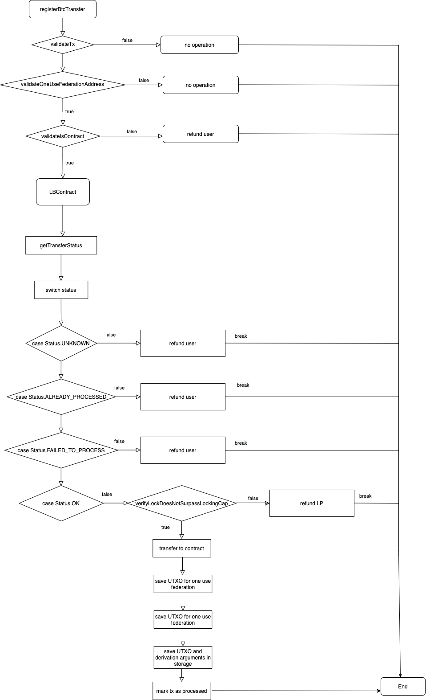

# Fast Bridge
|RSKIP          |           |
| :------------ |:-------------|
|**Title**      |Fast Bridge |
|**Created**    |15-SEP-20 |
|**Author**     |GM |
|**Purpose**    |USa |
|**Layer**      |Core |
|**Complexity** |2 |
|**Status**     |Draft |

## Abstract

This RSKIP allows a user to transfer BTC to RSK in a fast way, where a third party takes the risk to advance the payment in RBTC to the user.

## Motivation

Allowing users to transfer BTC to RSK immediately, without waiting for usual peg-in confirmations. This also generates a market between user who want to fast peg-in and those who count on liquidity.

## Specification

The system comprises one or more liquidity providers (LPs), listed in an onchain marketplace. Interactions with LPs are intermediated using a dApp or a website.

#### Liquidity Providers contract

In order to interact with Bridge, the Liquidity Provider contract must have an API format with functions: 

        function transferStatus(bytes32[]) return uint external {
            return status;
        }

Where status is an integer value:

**0 = OK**
**-1 = UNKNOWN
-2 = ALREADY_PROCESSED
-3 = FAILED_TO_PROCESS**

And a payable function:

        function transferFunds(bytes32[]) external payable {
            emit FundsReceived(msg.value);
        }

#### Bridge

The bridge is the most affected by this project. It will include:
- Create **registerBtcTransfer**() method.

#### registerBtcTransfer()

**Parameters**:
- *Transaction* rskTx: RSK transaction
- *byte[]* btcTxSerialized: Serialized Bitcoin transaction
- *int* height: Block number where the transaction is present
- *byte[]* pmtSerialized: Serialized partial merkle tree
- *Sha256Hash* derivationArgumentsHash: A hash created from all the derivation arguments
- *Address* userRefundAddress: User BTC refund address
- *RskAddress* LBCAddress: Liquidity Bridge Contract address
- *Address* LPBtcAddress: Liquidity Provider BTC address

**Flow**:

- Verifies the transaction hash is part of the merkle tree, and that the transactions was not already processed
- Verifies tx is sending funds to address derivated from Federation using the provided derivation arguments (creating a Hash256 from those arguments)
- Verifies provided Liquidity Bridge Contract address actually belongs to a contract
- Get status calling *transferStatus* method from Liquidity Bridge Contract:
  - If status obtained is **UNKNOWN**, **ALREADY_PROCESSED** or **FAILED_TO_PROCESS**, refund to user is made.
  - If status obtained is **OK**, will check if Locking Cap value is surpassed:
    - If not surpassed, will transfer funds to Liquidity Bridge Contract
	- If surpassed, will refund Liquidity Provider

#### Flow chart

### UTXOs Storage

Two new entries will be created on Bridge storage when registerBtcTransfer() executes successfully in order to check if a UTXO was already processed.

These entries will be a tuple with:

**(UTXO, derivation arguments)**

**(derivation arguments, UTXO)**

The datetime will be saved too, as it is will be used for erasing old UTXOs.

After 7 days of being registered, the entries on the Bridge storage that contains the relations **(UTXO <-> derivation arguments)** will be erased through **updateCollections** method. If any UTXO is found after that period of time, it will be migrated to the active Federation before erasing it.

### Federation Address Derivation

The address derivation process will be carried out by creating a custom redeem script that will make a push of a 32 bytes hash created from the provided derivation arguments. That data is then dropped.

This new custom redeem scrtipt will have this structure::

    scriptPubKey: OP_HASH160 <redeemScriptHash> OP_EQUAL
    scriptSig: OP_0 <signatures> <redeemScript>
    redeemScript: <derivationArgumentsHash> OP_DROP OP_M <publicKeys> OP_N OP_CHECKMULTISIG

### Copyright

Copyright and related rights waived via [CC0](https://creativecommons.org/publicdomain/zero/1.0/).
