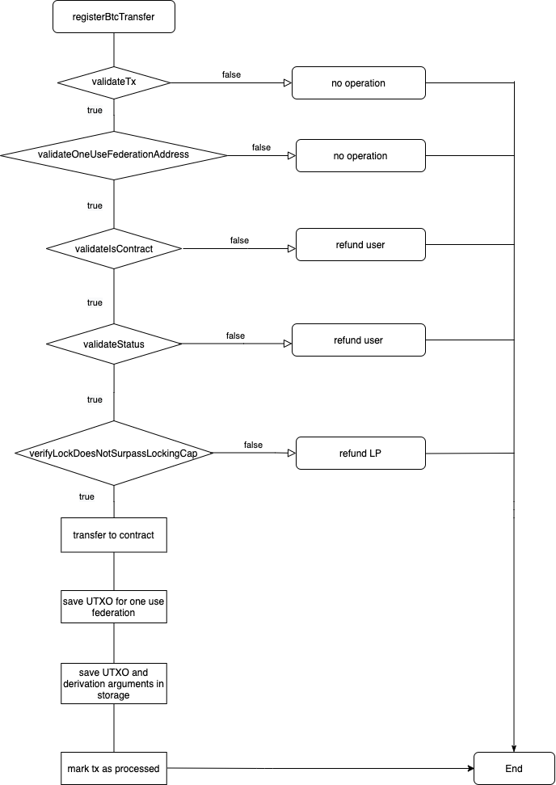

# Fast Bridge
|RSKIP          |           |
| :------------ |:-------------|
|**Title**      |Fast Bridge |
|**Created**    |15-SEP-20 |
|**Author**     |GM |
|**Purpose**    |USa |
|**Layer**      |Core |
|**Complexity** |2 |
|**Status**     |Draft |

## Abstract

This RSKIP allows a user to transfer BTC to RSK in a fast way, where a third party takes the risk to advance the payment in RBTC to the user.

## Motivation

Allowing users to transfer BTC to RSK immediately, without waiting for usual peg-in confirmations. This also generates a market between user who want to fast peg-in and those who count on liquidity.

## Specification

The system comprises one or more liquidity providers (LPs), listed in an onchain marketplace. Interactions with LPs are intermediated using a dApp or a website.
This RSKIP specifies the requirements for consensus changes without limiting the actual implementation of the Liquidity Providers market.

#### Bridge

The bridge is the most affected by this project. It will include:
- Create **registerBtcTransfer**() method.

#### registerBtcTransfer()

**ABI Signature**

        function registerBtcTransfer(bytes btcTxSerialized, int heigth, bytes pmtSerialized, bytes32 derivationArgumentsHash, string userRefundBtcAddress, string LiquidityBridgeContractAddress, string LiquidityProviderBtcAddress, bool shouldTransferToContract)

**Derivation Arguments**

The derivation arguments are values used to closed the agreement between the Liquidity Provider and the user. Some of these parameters are the RSK address where funds will be received, the BTC refund address, the Liquidity Bridge Contract address, the value to transfer, de amount ob BTC blocks that the Liquidity Provider should wait before advancing funds, the Liquidity Provider BTC refund address, the Federation address, and some other values that are domain of the Liquidity Provider.

**Parameters**:
- *byte[]* btcTxSerialized: Serialized Bitcoin transaction following Bitcoin serialization
- *int* height: BTC block number where the transaction is present
- *byte[]* pmtSerialized: Serialized partial merkle tree (following bitcoinj structure) that proves that the transaction belongs to the indicated block
- *Sha256Hash* derivationArgumentsHash: A 32 bytes hash created from the derivation arguments
- *string* userRefundBtcAddress: Base58 string representing the user BTC refund address
- *string* LiquidityBridgeContractAddress: String representing Liquidity Bridge Contract address
- *string* LiquidityProviderBtcAddress: Base58 string representing  the Liquidity Provider BTC refund address
- *bool* shouldTransferToContract: Status provided by Liquidity Provider Contract to know if should transfer value to contract or not

**Flow**:

- Bridge receives a call from Liquidity Bridge Contract and validates that the sender of that call is effectively the LBC address, that is received as parameter

- Performs the same validations the Bridge does in **registerBtcTransaction** to determine if the BTC transaction is legitimate (e.g.: txAlreadyProcessed, confirmations, PMT, etc)

- Verifies tx is sending funds to address derivated from Federation using the provided derivation arguments and hashing them:

	`Sha256Hash(derivationArgumentsHash, userRefundAddress, LBCAddress, LPBtcAddress)`

- Verifies that the derivated address does not exist in BridgeStorage (no entry was created using  the Sha256Hash described above)

- Verifies provided Liquidity Bridge Contract address actually belongs to a contract

- Validates the shouldTransferToContract value received as parameter from Liquidity Bridge Contract:

 - If status obtained is **true**, will check if Locking Cap value is surpassed:
    - If not surpassed:
		- Bridge will transfer value to the Liquidity Bridge Contract
		- will save UTXO to derived address
		- will save UTXO in BridgeStorage (UTXO <-> Sha256Hash(Derivation Arguments))
		- will mark tx as processed

	- If surpassed, will refund Liquidity Provider

 - If status obtained is **false**:
   - Refund user

- Returns an integer value indicating the execution status:

   ` -1: Refund user`

   `-2: Refund Liquidity Provider`

   `>0: Value transfered to user`

#### Limitations
- Transactions with depth bigger than 4320 will not be processed. That is enough depth to be able to search backwards one month worth of blocks.
If given depth is bigger than the accepted limit, funds will be lost

- If given transaction is invalid or provided address cannot be calculated from the given derivation arguments, funds will be lost

#### Flow chart

### UTXOs Storage

Two new entries will be created on Bridge storage when registerBtcTransfer() executes successfully in order to check if a UTXO was already processed.

These entries will be a tuple with:

**(UTXO, derivation arguments)**

**(derivation arguments, UTXO)**

The datetime will be saved too, as it is will be used for erasing old UTXOs.

After 7 days of being registered, the entries on the Bridge storage that contains the relations **(UTXO <-> derivation arguments)** will be erased through **updateCollections** method. If any UTXO is found after that period of time, it will be migrated to the active Federation before erasing it.

### Federation Address Derivation

The address derivation process will be carried out by creating a custom redeem script that will make a push of a 32 bytes hash created from the provided derivation arguments. That data is then dropped.

This new custom redeem scrtipt will have this structure::

    scriptPubKey: OP_HASH160 <redeemScriptHash> OP_EQUAL
    scriptSig: OP_0 <signatures> <redeemScript>
    redeemScript: <derivationArgumentsHash> OP_DROP OP_M <publicKeys> OP_N OP_CHECKMULTISIG

 This custom redeem script is executed in the same way to the standard one, allowing the same Federation members to sign the releases of these ad-hoc Federations.

### Copyright

Copyright and related rights waived via [CC0](https://creativecommons.org/publicdomain/zero/1.0/).
