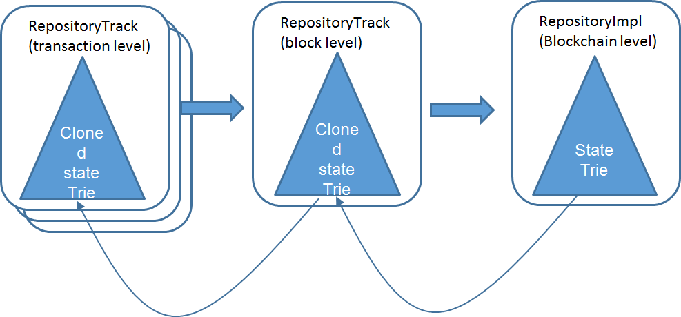
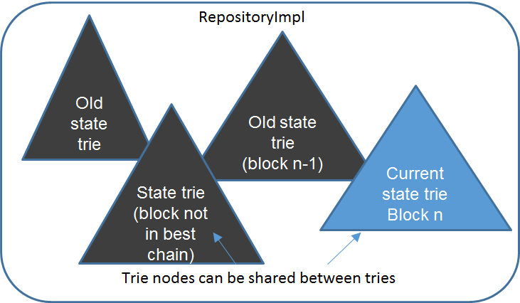

# New Binary Trie

|RSKIP          |24           |
| :------------ |:-------------|
|**Title**      |New Binary Trie|
|**Created**    |23-DIC-2016 |
|**Author**     |SDL |
|**Purpose**    |Sca |
|**Layer**      |Core |
|**Complexity** |3 |
|**Status**     |Adopted |

# **Abstract**

The current RSK trie (inherited from Ethereum) has several problems, both in its design and in its implementation. This RSKIP attempts to current these problems and also improve the performance of the node by adding lazy evaluation of hashes in the trie, and providing an uniform cache structure.

NOTE: Parts of this document has been deprecated because the method described here is not compatible with parallel verification.

# **Motivation**

The current RSK trie (inherited from Ethereum) has several problems, both in its design and in its implementation:

 - The data structure is radix-16, which means that membership proofs tend to be 4 times larger than binary membership proofs. 

- The world-state consist of the state trie, plus the contract storage tries, plus the contract codes. Each of these data structures must be  managed by an appropriate cache system that decides when to keep the data in memory, when to send it to SSD disk or even HDD disk. This multiplicity of caches of different kinds complicates the design of the platform node considerably.

- The RSK implementation of the trie is polymorphic, generic  and very difficult to understand. None of its generic features is needed.

- Some of the design rationale items were proven wrong by Vitalik itself.

- By being radix-16, modifying a leaf node requires more hashing operations than in a binary trie. For example, assuming a balanced 2^28 elements trie, and assuming finalizing the hash consumes an extra compression round, the radix-16 trie requires 17* 7=119 hash compressions, while the binary trie requires 84 hash compressions.

This RSKIP attempts to correct these problems and also improve the performance of the node by adding lazy evaluation of hashes in the trie, and providing an uniform cache structure.

The design rationale of the new RSK trie is the following:

1. Storage efficient hash map.

2. Very time efficient insert/delete/search in theory and practice. (hashes)

3. Authenticated Data structure

4. Allow short membership proofs

5. Authentication tag independent of insertion order. (low priority)

6. Prevent DoS attacks: O(n Log n) insert/delete/search granted

7. Be a simple as possible.

8. Differential serialization with low overhead

The current system is depicted below:

New system:

The trie is immutable, and changes are applied by "cloning". Cloning is the operation that creates a new trie by just copying the root node pointer, and nothing more. After a tree has been cloned, any node can be modified by first replacing it with a cloned  node with all the same fields intact, and then replacing the required fields. Afterwards, all nodes in the path to the root are cloned by the same algorithm, so a modification in a left node always implies the cloning of all nodes up to the root (depicted in red color).

Note that the hashes of the nodes are not computed immediately, but lazy-computed, only when they are required by the user.

This implementation assumes that the full tree can be kept in memory, and when a branch of the trie has not been used it can be kept in SSD disk, by adding to the tree a placeholder that references the remaining part to be loaded from disk.

There are two ways of use the new trie structure for block execution. The first way is by using the caches (CACHE), in the same way it was done before (but now there is a single kind of resource cache, the node). The second way (simpler) is using tree cloning in cascades (the Clone, Commit, Rollback method or CCR)

Thought the second method is simpler, when the need came to evaluate transactions in parallel in Bamboo release, it will be necessary to use caches, since the tree cloning assumes transactions are serialized.

## Clone, Commit, Rollback (CCR) method for block verification

This method is based in the following actions previously described:

**Clone**: just copy the root pointer. "Close" master repository to prevent other writes.

**Rollback**: just discard the RepositoryTrack

**Commit**: change the root of the parent repository to the root of the RepositoryTrack (single pointer assignment)

The method has the following properties: 

* Simplification: No nodes swapped out to disk.

* Assumption: all modifications to the tree fit in memory.

* Java garbage collector will do the hard work for us.

Whenever a node is not referenced anymore, is removed by the garbage collector from memory. A weak reference can be used so nodes are stored in RAM the longer, but are removed from RAM if necessary.

 

Also we merge the contract storage memory and account/contract memory into a single tree. This is described in [RSKIP16].

## Scalability

### Space used

* An account node (key+data+overhead) occupies 200 bytes.

* If maximum Repository memory consumption is 1 Gb ->  5M of accounts

* Enough to get started for 1 year.

During this period we can improve the tree with weak references to nodes stored in SSD.

### Changeset size

* Each node stores in memory 2 hours of changes. To revert more, transactions must be replayed.

* 10 transactions per second

* 100 transactions per block

* 8640 blocks a day.

* Each leaf node occupy 128 bytes. Each intermediate node occupy 64 bytes.

* Each block consumes approximately (100*200) = 20 Kbytes

* 2 hours of changes consumes 1.4 Mbytes.

Other improvements

•Performance:

•SSTORE / SLOAD: no sha3 on keys

•Lazy hash digest computations as nodes are not referenced by hash

•Fast clone, rollback and commit

•Simplicity:

•Easy to debug (no indirect references through hashes)

# **Specification**

[RSKIP16]: https://github.com/rsksmart/RSKIPs/blob/master/IPs/RSKIP16.md

# **Copyright**

Copyright and related rights waived via [CC0](https://creativecommons.org/publicdomain/zero/1.0/).