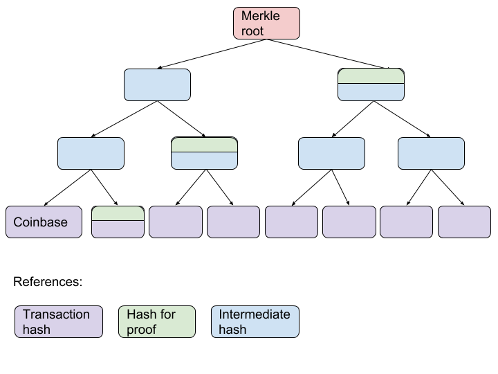

#  **Merkle Proof serialization**  

| RSKIP          | 92                                           |
| :------------- | :------------------------------------------- |
| **Title**      | Merkle Proof serialization                   |
| **Created**    | 08-AUG-2018                                  |
| **Author**     | DLL & MC                                     |
| **Purpose**    | Sca                                          |
| **Layer**      | Core                                         |
| **Complexity** | 2                                            |
| **Status**     | Adopted                                      |

# Abstract

This RSKIP proposes a new format for the Merkle Proof format which is smaller and easier to work with. A small change to the block hash calculation is also introduced to prevent malleability attacks.


# Motivation

The current Merkle Proof format is a Partial Merkle Tree based on the Bitcoin implementation. This is a general-purpose structure that can be used to prove different information about the underlying Merkle Tree. RSK’s implementation is subject to malleability issues that allow an attacker to forge uncles with little to no computing power.

In order to fix the malleability issues and reduce block size, we propose a new format that uses known properties about the underlying Merkle Tree to minimize the amount of information needed to be encoded in the proof.


# Specification

## Merkle Proof format



Above is the representation of a Partial Merkle Tree for a Bitcoin block with 8 transactions. Since the coinbase transaction is always the first transaction in a Bitcoin block, we know that the Partial Merkle Tree for a Merged Mining proof will always have this structure.

We can take advantage of this and define the following proof function:

```
reduce(combinationFunction, hashesForProof, coinbaseHash)
```

Where `combinatorFunction(left, right)` is:

```
Sha256Hash.wrapReversed(
    Sha256Hash.hashTwice(
        left.getReversedBytes(), 0, 32,
        right.getReversedBytes(), 0, 32
    )
);
```

The `hashesForProof` are the hashes in green (the Partial Merkle Tree intermediate hashes except for the coinbase hash).

Since Merkle Root hash is present in the RSK block header and the Coinbase hash can be derived, a minimal format for the merkle proof is derived from the proof function:

```
[hashForProof1, hashForProof2, ..., hashForProofN]
````

Where the hashes for proof are ordered bottom to top. We choose to serialize these hashes as a simple concatenation of the byte representation of the hashes. The following properties derive from this format:

* The merkle proof will have a length in bytes that is a multiple of 32 (the hash length)
* The empty value is valid, and it provides a proof for Bitcoin blocks with a single transaction (the Coinbase). Note that the Coinbase hash and the Merkle Root hash are the same in this case.
* The number of hashes is always `tree height - 1`, which grows logarithmically with the number of transactions in the block
* Every bit in the merkle proof is part of a hash and every hash is used to compute the merkle root, thus changing a single bit always invalidates the merkle proof


## Block hash calculation

We use this opportunity to propose a new RSK block hash calculation. We propose that in the encoding phase of the hash calculation we leave out both the `bitcoinMergedMiningMerkleProof` and the `bitcoinMergedMiningCoinbaseTransaction` fields.

This change will prevent an array of malleability attacks such as the one that motivates this Improvement Proposal.

Attacks are prevented _by design_ with this new hash calculation because the (possibly) malleable headers are not included in the calculation anymore. Even if a header was malleable, this error would not allow an attacker to generate uncles blocks.


# Copyright

Copyright and related rights waived via [CC0](https://creativecommons.org/publicdomain/zero/1.0/).


